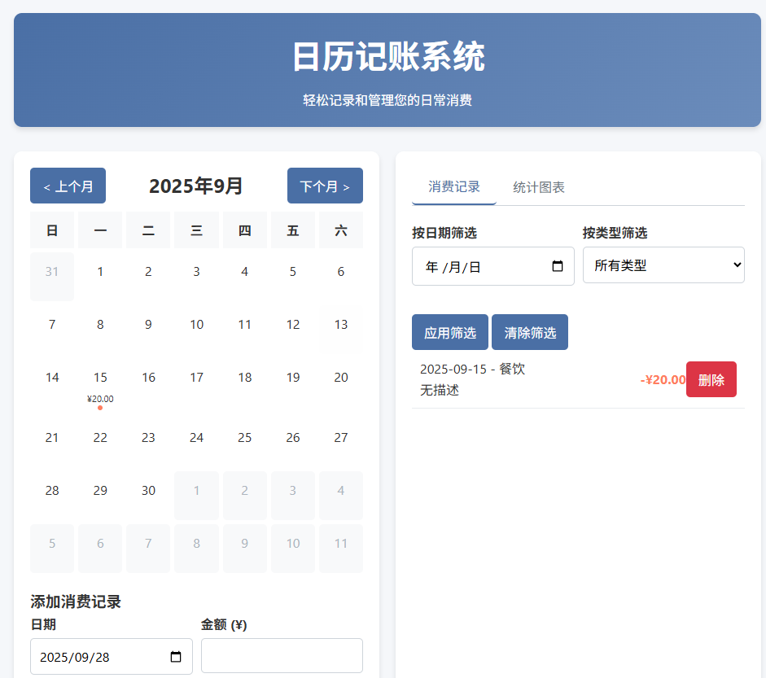
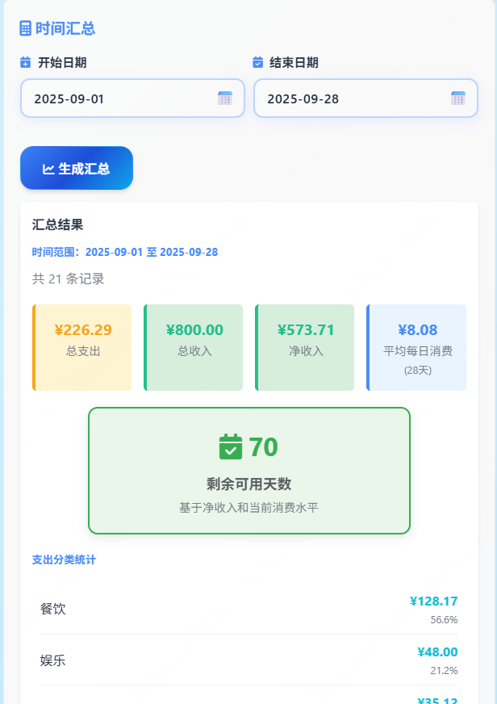

## 介绍 📖

日历记账系统是一个基于 `HTML + CSS + JavaScript` 的本地记账网页应用🌐，内置现代化 `UI`、日历视图、筛选与统计功能，数据默认存储在浏览器 `IndexedDB`，支持一键导入/导出 `JSON`。

### 项目截图 👀






### 功能特性 🌟

- 📅 日历视图：按月展示每日收支概览，带当日总支出提示点与金额汇总
- ➕ 一键添加记录：日期、金额、类型、收/支、描述
- 🔍 右侧筛选：按日期与类型快速筛选记录（与日历点击联动）
- 📊 数据统计：支持柱状图、折线图、饼图（使用 `Chart.js`）
- ⏱️ 时间汇总：任意日期范围的收入/支出/净收入、平均每日消费与“剩余可用天数”估算
- 💾 数据持久化：`IndexedDB` 本地存储；兼容历史 `localStorage` 数据并提供迁移进度反馈
- 📥📤 导入/导出：支持 `JSON` 文件导入与一键导出
- 🖥️ 纯前端：单个 `HTML` 文件即可离线使用

### 在线预览与使用 🚀

直接用浏览器打开 `bookkeeping.html` 即可使用（推荐 Chrome/Edge）🌐。

1. 点击日历的某一天，会自动：
   - 🎯 高亮所选日期
   - 🔄 同步右侧“按日期筛选”输入框
   - 📋 列表即时筛选为该日期
2. 填写“添加消费记录”区域并点击“添加记录”
3. 在“消费记录”页签中，可按日期和类型进行筛选；“清除筛选”恢复全部
4. 在“统计图表”页签中选择图表类型和统计周期，点击“生成图表”
5. 在“时间汇总”区域选择开始/结束日期并“生成汇总”

### 技术栈 ⚙️

- 🏗️ 原生 `HTML/CSS/JavaScript`（无构建依赖）
- 🗄️ `IndexedDB`（数据持久化）
- 📈 `Chart.js`（统计图表）
- 🎨 `Font Awesome`（图标）

### 项目结构 📁

```
Desktop/
├─ bookkeeping.html   # 应用主文件（包含样式与脚本）
└─ README.md          # 本说明文件
```

### 数据导入与导出 💾

- 📤 导出：点击“导出数据”生成包含全部记录的 `JSON` 文件
- 📥 导入：点击“导入数据”选择符合字段的 `JSON`，系统会校验并追加至现有数据
- 🔄 首次使用含有历史 `localStorage` 的旧版本数据时，会自动迁移至 `IndexedDB`，并显示迁移进度

数据记录的基本字段：

```
{
  "id": "时间戳字符串",
  "date": "YYYY-MM-DD",
  "amount": "字符串化的小数，保留两位",
  "type": "food|shopping|transport|entertainment|utilities|other",
  "category": "expense|income",
  "description": "可选描述"
}
```

### 开发与自定义 🛠️

- 💻 所有代码在 `bookkeeping.html` 中，便于复制与二次开发
- 🎨 `UI` 主题色在 `:root` CSS 变量中统一管理，可按需调整
- ➕ 如需扩展消费类型或字段，可在“添加记录”选择与渲染逻辑中同步调整

### 隐私与数据 🔒

- 🛡️ 所有数据均保存在本地浏览器 `IndexedDB` 中，不会上传到服务器
- ⚠️ 更换浏览器/设备或清理站点数据会导致本地数据不可用，请定期导出备份

### 兼容性 💻

- 🌐 现代浏览器（Chrome、Edge、Firefox 最新版）。旧版浏览器可能缺少 `IndexedDB` 或部分特性

## 结尾 🎉

最后欢迎大家使用这个系统👋，虽然这个系统是网页版，但是对于打工人👨‍💼来说我觉得网页版比手机版更好用，我平时记账都是上班摸鱼🐟或者提前到公司的时候就打开这个网站进行记账，很方便，这个也看个人习惯。

**项目地址**：

- 🌐 在线体验：https://www.pljzy.top/bookkeeping.html
- 💻 GitHub仓库：https://github.com/ZyPLJ/bookkeeping

可以放心使用，数据存本地🔒，你甚至可以把`html`代码下载下来，在本地浏览器打开💾，或者直接克隆`GitHub`仓库到本地使用。

后续我也会对这个系统进行一系列优化，以完成我的记账需求。🔮